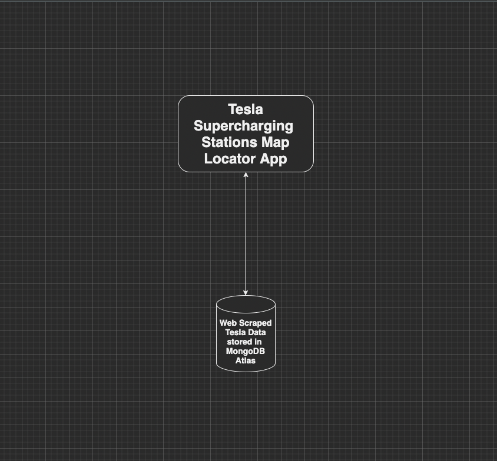
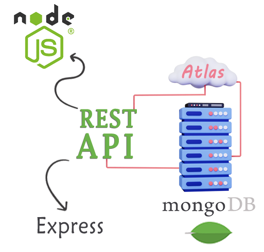

<h1 align="center" style="margin-top: 0px;">Telsa Supercharging Station Map Locator App</h1>
  
<h2> Overview </h2>
<p> This App was created for my Springboard Capstone project. It pulls data from the MongoDB database where I stored all the names of the sites, geolocation, number of stalls available at each site, and the statues of the site location to display if they are open to the public. </p> 


Live Link: https://backendtesla1.azurewebsites.net

<p align="center" style="margin-bottom: 0px !important;">

<h2> Features </h2> 
⋅ A Create React App that uses react-leaflet to display Tesla Supercharging Stations on a World Map


<p align="center" style="margin-bottom: 0px !important;">
  </br>

  
<div align="center">


<div align="center">

 
<div align="left">


<h2 align="center" style="margin-top: 0px;">API Schema</h2>

<p align="center" style="margin-bottom: 0px !important;">
  

</br>
  </br>
  </br>
  
<h2 align="center" style="margin-top: 0px;">API with MongoDB & Atlas cloud service</h2>

<p align="center" style="margin-bottom: 0px !important;">
  

  </br>
   </br>
    </br>
  <h1>Running this project locally</h1>
  
  <h5> From the repo:</h5>  
Clone this project locally

```sh
$ git clone https://github.com/williamthethird/tesla-react-backend.git
$ cd tesla-react-backend
$ npm install 
```

Start the app:

```sh
$ nodemon app.js
```
  
On browser:

```sh
http://localhost:3000/
``` 
  </br>
  <h1>Dev Dependencies</h1> 
  ⋅ React</br>
  ⋅ React-DOM</br>
  ⋅ React-Leaflet</br>
  
  </br>
  </br>
  </br>
  

Idea inspired from:</br>
https://www.youtube.com/playlist?list=PLO6KswO64zVs3XY63flkObOzMd8MMzXPx
